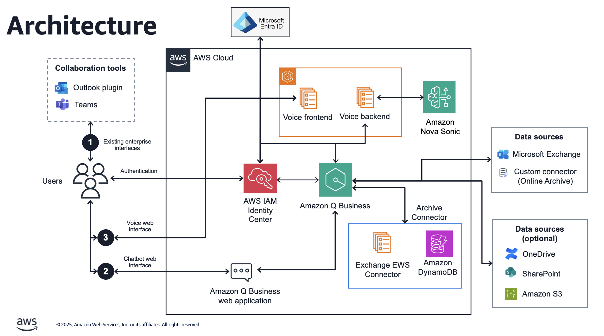

# Smart Email Solution



This repository contains two main components for intelligent email processing and interaction:

## Components

### [Exchange EWS Connector](./exchange-ews-connector/)
A connector that automatically syncs Exchange emails to Amazon Q Business for intelligent search and retrieval. Features include:
- **Multi-Account Support**: Process multiple Exchange mailboxes in a single execution
- **Security & Access Control**: User-specific document access with ACL implementation
- **Secure Configuration**: Credential management via AWS Parameter Store with encryption
- **Duplicate Prevention**: DynamoDB tracking with automatic table creation
- **Content Processing**: Optimized HTML and plain text email processing with size limits
- **Conflict Resolution**: Automatic Q Business sync job conflict handling
- **Field Mapping**: Official AWS Q Business Exchange field mappings for metadata
- **Deployment Automation**: Complete deployment scripts with container-based builds

### [Voice Chatbot](./voice-chatbot/)
A Nova Sonic-powered voice chatbot with Next.js frontend and FastAPI backend. Demonstrates:
- **Real-time Voice Interactions**: Nova Sonic integration with barge-in support
- **Modular Tool System**: Extensible architecture with category-based tool organization
- **Dynamic UI Rendering**: Multiple component types (cards, images, videos, PDFs)
- **Email Querying**: Q Business integration for intelligent email search
- **Dual Result Architecture**: Separate outputs for AI model and UI display
- **Debug Features**: Optional audio recording for development and troubleshooting
- **Modern Stack**: Next.js 14, TypeScript, Tailwind CSS, and FastAPI

## Project Structure

```
smart-email-solution/
├── exchange-ews-connector/          # EWS Email connector
│   ├── modules/                     # Modular Python components
│   │   ├── config.py               # Configuration management
│   │   ├── ews_client.py           # Exchange Web Services client
│   │   ├── document_processor.py   # Email content processing
│   │   ├── qbusiness_client.py     # Amazon Q Business integration
│   │   ├── dynamodb_client.py      # DynamoDB operations
│   │   └── security_utils.py       # Security and encryption utilities
│   ├── qbusiness_ews_sync.py       # Main module
│   ├── deploy-config.sh            # Configuration deployment
│   └── requirements.txt            # Python dependencies
├── voice-chatbot/                   # Nova Sonic voice interface
│   ├── backend/                     # FastAPI backend
│   │   ├── api/                    # API endpoints
│   │   ├── tools/                  # Modular tool system
│   │   │   ├── base/              # Base classes and registry
│   │   │   ├── categories/        # Tool categories (utility, etc.)
│   │   │   └── tool_manager.py    # Tool registration
│   │   ├── debug_audio/           # Debug audio recordings (optional)
│   │   └── main.py                # FastAPI application
│   ├── frontend/                   # Next.js frontend
│   │   ├── app/                   # Next.js app directory
│   │   ├── components/            # React components
│   │   │   ├── ui/               # Base UI components
│   │   │   ├── tool-outputs/     # Tool result components
│   │   │   └── apps/             # Application components
│   │   └── lib/                  # Utility functions
│   └── docs/                      # Documentation and images
└── README.md                       # This file
```

## Getting Started

Each component has its own detailed README with setup instructions:
- [Exchange EWS Connector Setup](./exchange-ews-connector/README.md)
- [Voice Chatbot Setup](./voice-chatbot/README.md)

## Key Features

### Security & Compliance
- **Access Control Lists (ACL)**: User-specific document access in Q Business
- **Encrypted Configuration**: AWS Parameter Store with SecureString encryption
- **Multi-Account Isolation**: Secure processing of multiple Exchange accounts
- **Audit Trail**: Comprehensive logging and tracking

### Performance & Scalability
- **Optimized Processing**: Memory-efficient document handling with batching
- **Conflict Resolution**: Intelligent handling of concurrent operations
- **Size Management**: Automatic content truncation for large emails

### Developer Experience
- **Automated Deployment**: Complete CI/CD-ready deployment scripts
- **Modular Architecture**: Extensible tool system for easy customization
- **Debug Features**: Audio recording and comprehensive logging
- **Modern Stack**: Latest frameworks and best practices

## Architecture

The solution combines email data ingestion (Exchange connector) with intelligent voice-based querying (Voice chatbot), creating a complete smart email solution powered by AWS services. The modular design allows for independent deployment and scaling of each component while maintaining seamless integration through Amazon Q Business.
