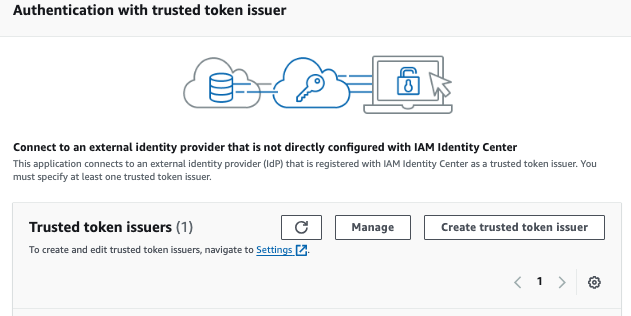
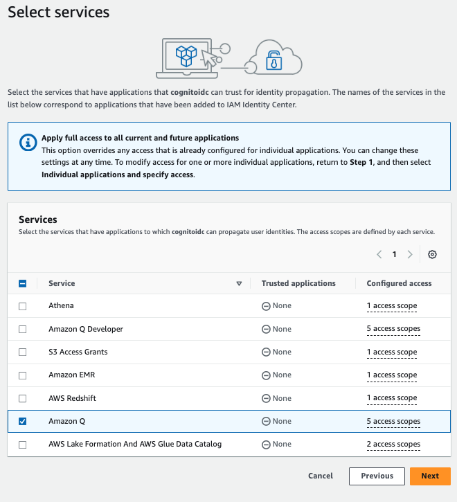

# How to setup Q Business for Nova Sonic Chatbot

**Note:** The instructions provided in this guide are specific to Cognito, but they should also work for other OIDC 2.0 compliant Identity Providers (IdPs) with minor adjustments.

👨‍💻 The workflow includes the following steps:
1.	First the user accesses the chatbot web application

2.	The user is then prompted to log with Cognito Hosted UI

3.  The backend server exchanges the token from Cognito with an IAM Identity Center token with the scope for Amazon Q Business

4.  The backend server assumes an IAM role and retrieve an AWS Session from Secure Token Service (STS), augmented with the IAM Identity Center token to interact with Amazon Q Business

5.	The backend server uses the ChatSync API from Amazon Q Business to carry out the conversation. Thanks to the identity-aware session, Amazon Q Business knows which user it is interacting with.
	
    *  The request uses the following mandatory parameters. 

        1.	**applicationId**: The identifier of the Amazon Q application
      
        2.	**userMessage**: An end user message in a conversation.
      
    * Amazon Q Business returns the response as a JSON object (detailed in the  [Amazon Q documentation](https://boto3.amazonaws.com/v1/documentation/api/latest/reference/services/qbusiness/client/chat_sync.html)) and below are the few core attributes from the response payload.
      1.	**systemMessage**: An AI-generated message in a conversation
    
      2.	**sourceAttributions**: The source documents used to generate the conversation response.

## Setup of this solution

### Prerequisites: 
Before you deploy this solution, make sure you have the following prerequisites set up:

- A valid AWS account.
- An AWS Identity and Access Management (IAM) role in the account that has sufficient permissions to create the necessary resources. If you have administrator access to the account, no action is necessary.
- An existing, working Amazon Q Business application configured with IAM Identity Center.

### 🚀 Deploy this Solution: 

Step 1: Launch the following AWS CloudFormation template [business-webapp.yaml](qbusiness-webapp.yaml) to deploy Cognito user pool and required resources.

---------------------------------------------------------------------

⚙️ Provide the following parameters for stack

•	**Stack name** – The name of the CloudFormation stack (for example, **AmazonQBusinessVoice**)

•	**AuthName** – A globally unique name to assign to the Amazon Cognito user pool. Please ensure that your domain name does not include any reserved words, such as cognito, aws, or amazon. (for example, **qbusinessvoice**)

•	**IdcApplicationArn** – Identity Center customer application ARN , keep it blank on first run as we need to create the cognito user pool as part of this stack to create [IAM Identity Center application with a trusted token issuer](https://docs.aws.amazon.com/singlesignon/latest/userguide/using-apps-with-trusted-token-issuer.html)

•	**QApplicationId** – The existing application ID of Amazon Q Business


🔗 Once the stack is complete , copy the following Key from the Output tab .
------------------------------------------------

**Audience** : Audience to setup customer application in Identity Center

**RoleArn** : ARN of the IAM role required to setup token exchange in Identity Center

**TrustedIssuerUrl** : Endpoint of the trusted issuer to setup Identity Center

Step 2: Create an IAM Identity Center Application 
---------------------------------------------------------------------

- Navigate to AWS IAM Identity Center, and add a new custom managed application.

  **Select application type** -> then select OAuth2.0 -> Next

  

  If you can't find the option of creating a new custom managed application, please [Enable Organizations with IAM Identity Center](https://docs.aws.amazon.com/singlesignon/latest/userguide/get-set-up-for-idc.html).

- Provide an application name and description and select the below option as shown in the  image

  


- Now create a trusted token issuer 

  

- In the Issuer URL  -> provide the ***TrustedIssuerUrl*** from Step 1,provide an issuer name and keep the map attributes as Email

  


- Then navigate back to IAM Identity Center application authentication settings , select the trusted token issuer created in the previous step[refresh it if you don't see in the list] and add the Aud claim -> provide the ***Audience*** from step 1 , then click Next

  

- In Specify application credentials ,  Enter IAM roles -> provide ***RoleArn*** from Step 1

  

- Then Review all the steps and create the application.

- Once the application is created, go to the application and -> Assigned users and groups .

  

- Then set up the Trusted application for identity propagation , follow the below steps to Amazon Q as Trusted applications for identity propagation

  

  

  

Step 4: Once the update is complete, proceed with backend and frontend setup of Nova Sonic Chatbot.

In the frontend setup, specify the following .env properties. Make sure "NEXT_PUBLIC_REQUIRE_LOGIN=true" is set.

```
NEXT_PUBLIC_COGNITO_DOMAIN=your_cognito_domain.auth.region.amazoncognito.com
NEXT_PUBLIC_CLIENT_ID=your_client_id
NEXT_PUBLIC_REDIRECT_URI=http://localhost:3000/callback

NEXT_PUBLIC_REQUIRE_LOGIN=true
```

In the backend setup, specify the following .env properties. Make sure "REQUIRE_LOGIN=true" is set.

```
COGNITO_DOMAIN=your-cognito-domain.auth.region.amazoncognito.com
CLIENT_ID=your-client-id
REDIRECT_URI=http://localhost:3000/callback

REGION=us-east-1
IDC_APPLICATION_ID=arn:aws:sso::account-id:application/ssoins-xxxxx/apl-xxxxx
IAM_ROLE=arn:aws:iam::account-id:role/your-QServiceRole-name
AMAZON_Q_APP_ID=your-app-id

REQUIRE_LOGIN=true
```

Step 5: For the first login attempt try to Sign up, use the same email id and password for the user that is already exist in IAM Identity Center.

⚡ To eliminate the need for provisioning users in both the Cognito User Pool and the Identity Center, you can follow the link below to create a second custom app (SAML) in the Identity Center. This custom app will act as the Identity Provider for the Cognito User Pool.

🔗 [Video](https://www.youtube.com/watch?v=c-hpNhVGnj0&t=522s)

🔗 [Instructions](https://repost.aws/knowledge-center/cognito-user-pool-iam-integration)